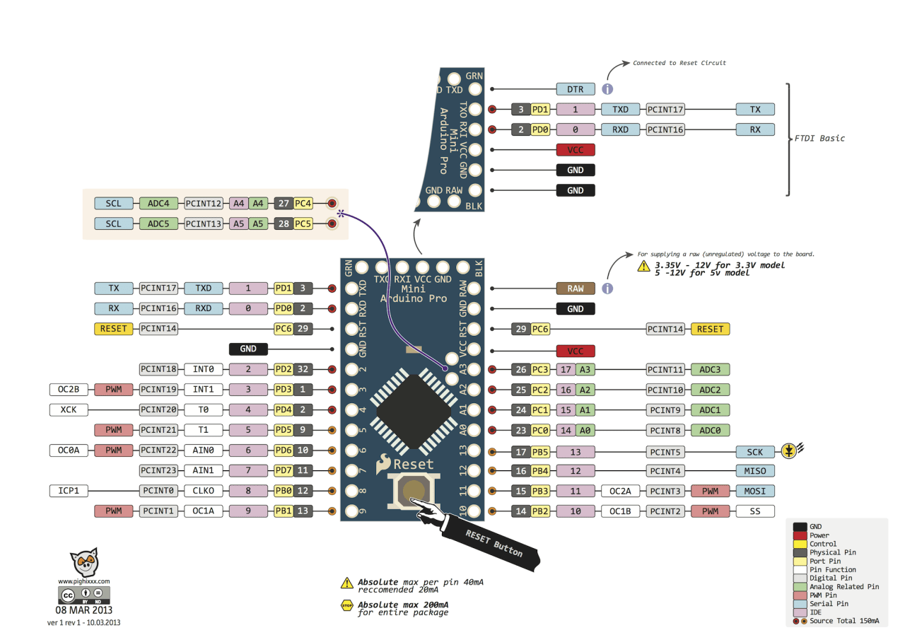
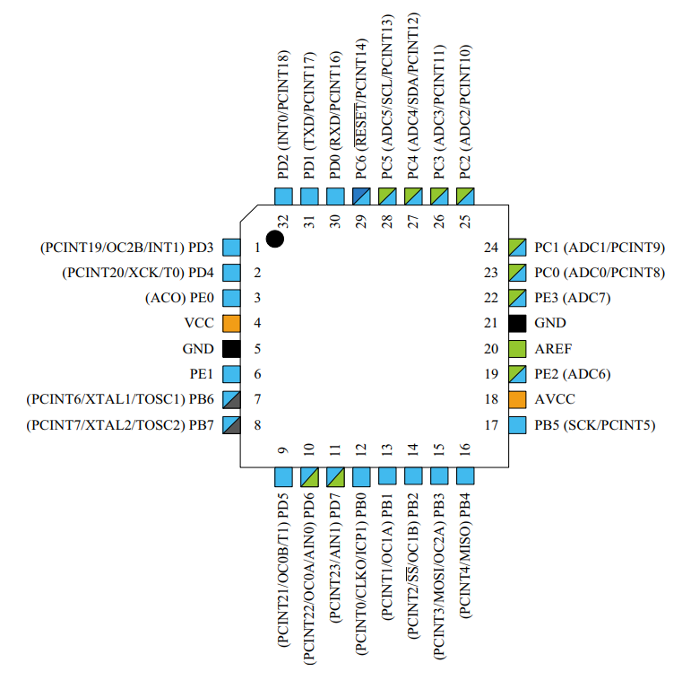
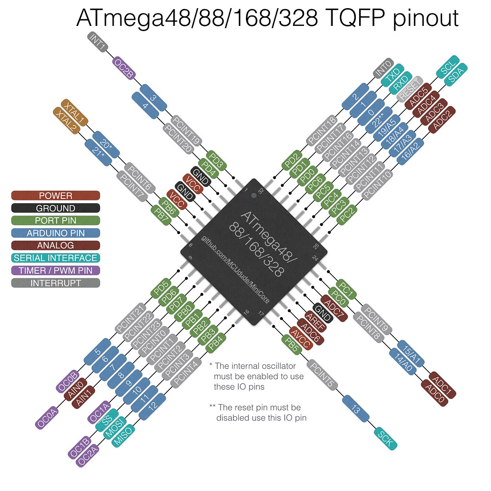
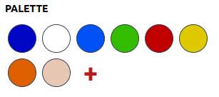
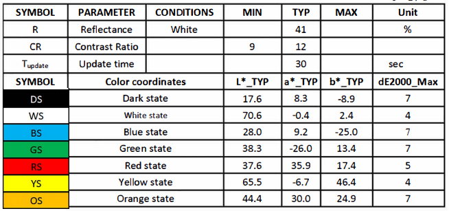
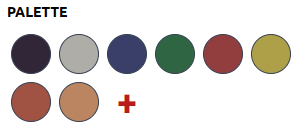
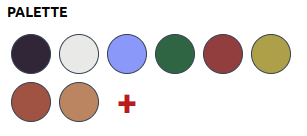
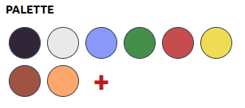

# Docs

Unlike CNLohr, I'm not using a custom board as I didn't have time to order it. Instead I used an Arduino Pro Mini Board which has an ATmega328P-AU chip (unlike the ATmega168PB CNLohr used). It should be mostly compatible for what we need (no special chip features are used, everything is bit-banged). 



The Pro Mini board has a 16MHz crystal, whereas CNLohr used the internal 8MHz oscillator and a 32.768 kHz external one.
I need to modify my hardware as the RTC oscillator is needed.

I am using a USBASP ICSP programmer instead of usbtiny.
Note: You may need to add udev rules or just run avrdude as admin. PlatformIO udev rules should do. Otherwise, see this guide: https://andreasrohner.at/posts/Electronics/How-to-fix-device-permissions-for-the-USBasp-programmer/

I am using a 7.3" epaper panel instead of the 5.x" one CNLohr used. Therefore, I need to change the display diver slightly according to manufacturer notes.
Datasheet: https://files.waveshare.com/upload/d/db/7.3inch_e-Paper_%28F%29_Specification.pdf

Steps to porting:
- Check for pin compatibility
- Check wether connecting SD-Card is possible
- Check whether firmware can be compiled for this chip
- Check fuse configuration
- Modify firmware to adjust timing for faster clock
  - Adjust the cycle-based 24-hour timing system
  - Adjust the bit-banged driver as with a 16 Mhz crystal some delays will probably need to be added to get the timing right
- Modify firmware to work with new panel

## Step 1: Check for pin compatibility

Problem: the PB chip series is not quite compatible with the P chip series. In fact, it's an overhauled chip.

<table>
    <tr>
        <th>PB-Series Chips</th>
        <th>P-Series Chips</th>
    </tr>
    <tr>
        <td>Datasheet: (to be added)</td>
        <td>Datasheet: https://ww1.microchip.com/downloads/en/DeviceDoc/Atmel-7810-Automotive-Microcontrollers-ATmega328P_Datasheet.pdf</td>
    </tr>
    <tr>
        <td> </img></td>
        <td> </img></td>
    </tr>
</table>

Problems:
- (PE0 and PE1 programming pins don't exist but they are not needed luckily)
- we cannot use pins PE2 and PE3, as the older 328P chip only has ADC functionality on these. In fact, they are not even on any register.
  - don't need PE2, as we will put power to SD and power to display together.
  - don't need PE3, as we will not be using card detection. We will simply assume the card is present.

## Fuse configuration

Fuse Calculator: https://www.engbedded.com/fusecalc/

My original Fuse config (from Arduino-compatible setup): (E:FD, H:DE, L:FF) (external oscillator)
Disable Brown-Out detection: (E:FF)
Fuse config for default internal 8MHz oscillator: (L:E2)
External full-swing is the same as CNLohr: (L:E6)

Currently, I was not able to get the RTC function to work, because my 32k crystal probably doesn't work (couldn't verify).

AVR RTC feature info: https://ww1.microchip.com/downloads/en/Appnotes/Atmel-1259-Real-Time-Clock-RTC-Using-the-Asynchronous-Timer_AP-Note_AVR134.pdf

## New panel support

I was able to implement support for the new display panel by simply copying the new init sequences from the manufacturer documentation. The display driver works on my AVR chip.

## SD card

I was able to connect and somewhat read from the SD card, however I was unable to properly access any filesystem. May need to be investigated further in the future.

## TBD ...

Currently, I don't have all the required parts to get the 24h auto-updating AVR firmware with ultra-low power consumption to work. I don't have a working 32k clock crystal and I need to get the project working quickly. 

Therefore, for the time being, I have opted to use a simple Arduino-Framework based SPI SD card firmware which simply loads a random .bmp picture from the card and displays it whenever powered on. A switch can be used to manually trigger a new image to be displayed.

I may implemented the proper firmware and automatic refreshing when I have more time in the future.

## Image preparation

In order to display an image, we have opted to properly size and dither it on a computer and then place it on the SD card in 24-Bit RGB888 Bitmap format.

For Floyd-Steinberg-dithering, a color palette has to be selected. We use all 8 Colors of the panel, including the unofficial "clean" color which is quite useful as a skin color.

For testing, the tool https://ditherit.com/ allows pasting a custom 8-Color palette and dithers the image.

Initially we used the following palette for testing which was just ruffly picked but looked surprisingly good on the actual epaper panel despite having a really blue-ish black and the color overall not matching to well on the computer:

```jsonc
// pal1
[
    {"hex":"#0006c5"},  // black
    {"hex":"#ffffff"},  // white
    {"hex":"#0052f7"},  // blue
    {"hex":"#34bd00"},  // green
    {"hex":"#c10000"},  // red
    {"hex":"#dfca00"},  // yellow
    {"hex":"#dd5f00"},  // orange
    {"hex":"#e8c7b4"}   // clean
]
```


The datasheet of the panel specifies the actual colors of the segments as Lab colors (except the "clean" color which is not officially supported):



Although this cannot be perfectly represented by RGB, we can try to convert the colors to RGB (using this tool: https://colorizer.org/) and use those as the pallet to get more realistic colors on the final image:

```jsonc
// pal2
[
    {"hex":"#302637"},  // black
    {"hex":"#aeada8"},  // white
    {"hex":"#393f68"},  // blue
    {"hex":"#306544"},  // green
    {"hex":"#923d3e"},  // red
    {"hex":"#ada049"},  // yellow
    {"hex":"#a05343"},  // orange
    {"hex":"#ba8560"}   // clean
]
```


This palette however produced a very bleached out image, mostly due to the more gray then white white color. Skin and white clothing were mostly just blobs of gray without any dithering effect. Adjusting the blue and white colors improves this a lot already:

```jsonc
// pal3
[
    {"hex":"#302637"},  // black
    {"hex":"#e9e9e7"},  // white (modified)
    {"hex":"#8a98f9"},  // blue (modified)
    {"hex":"#306544"},  // green
    {"hex":"#923d3e"},  // red
    {"hex":"#ada049"},  // yellow
    {"hex":"#a05343"},  // orange
    {"hex":"#ba8560"}   // clean
]
```


Further modifying the other colors makes for much more natural looking skin tones, at least on a regular computer screen:

```jsonc
// pal4
[
    {"hex":"#302637"},  // black
    {"hex":"#e9e9e7"},  // white
    {"hex":"#8a98f9"},  // blue
    {"hex":"#458f4a"},  // green (modified)
    {"hex":"#c74c4d"},  // red (modified)
    {"hex":"#efdb54"},  // yellow (modified)
    {"hex":"#a05343"},  // orange
    {"hex":"#fda76c"}   // clean
]
```


When tested on the real epaper panel, none of the above produced a really good result. pal3 produced lighter greens, but the entire image had a green tint.

We experimented some more with the panel, mixing colors from the above palettes and tweaking some and we went through a few iterations:

```jsonc
// pal5
[
    {"hex":"#302637"},
    {"hex":"#fafafa"},
    {"hex":"#0052f7"},
    {"hex":"#2ea102"},
    {"hex":"#c10000"},
    {"hex":"#dfca00"},
    {"hex":"#dd5f00"},
    {"hex":"#e8c7b4"}
]
```
```jsonc
// pal6
[
    {"hex":"#302637"},
    {"hex":"#fafafa"},
    {"hex":"#0052f7"},
    {"hex":"#2ea102"},
    {"hex":"#923d3e"},  // red
    {"hex":"#ada049"},  // yellow
    {"hex":"#a05343"},  // orange
    {"hex":"#e8c7b4"}
]
```
```jsonc
// pal7
[
    {"hex":"#302637"},
    {"hex":"#fafafa"},
    {"hex":"#0052f7"},
    {"hex":"#2ea102"},
    {"hex":"#923d3e"},  // red
    {"hex":"#dfca00"},
    {"hex":"#a05343"},  // orange
    {"hex":"#e8c7b4"}
]
```

In the end, we endet up with this palette which looks almost like the original, except truer reds and maybe better greens:

```jsonc
// pal8
[
    {"hex":"#302637"},
    {"hex":"#fafafa"},
    {"hex":"#0052f7"},
    {"hex":"#2ea102"},
    {"hex":"#923d3e"},  // red
    {"hex":"#dfca00"},
    {"hex":"#c97249"},
    {"hex":"#e8c7b4"}
]
```

For final "production", we are planning on using a simple bash script that takes a number of ruffly-correct shaped input images, crops them to 800x480, dithers them according to the pallet, converts them to the appropriate bitmap format and renames them to the required naming sequence for the firmware. This is done using imagemagick's mogrify and a simple command line tool called ["didder"](https://github.com/makew0rld/didder).

### Manual image file preparation

A few manual steps are required for preparing images:

- Fill your working directory with selected images (must be exactly ".jpg", not ".jpeg" or similar).
- The input images must be approximately 800x480 px (or slightly larger) in size.
  > **Note:** <br> Usually, you don't want to display the entirety of a photo on the small screen. Therefore it is helpful to first resize our images to about 1300x700 px in order to then be able to select the region-of-interest with approximately the correct resolution.

### Automatic dithering process 

To finalize the image files for the display, simply run the following one-liner in the folder with the .jpg files (didder and imagemagick are required):

```bash
for  f  in  *.jpg;  do  magick "$f"  -crop 800x480+0+0 - |  didder --in  -  --out  "$f".png  --palette '302637 fafafa 0052f7 2ea102 923d3e dfca00 c97249 e8c7b4'  edm --serpentine floydsteinberg; done  &&  sleep 1   &&  magick *.png %04d.bmp  &&  sleep 1  &&  rm *.png
```

This crops the images to their final size for the display (800x480 px, starting in the top-left corner), dithers them according to the selected palette (pal8), converts the resulting .png files to .bmp and renames them to the required number sequence (0000.bmp, 0001.bmp, ...).
